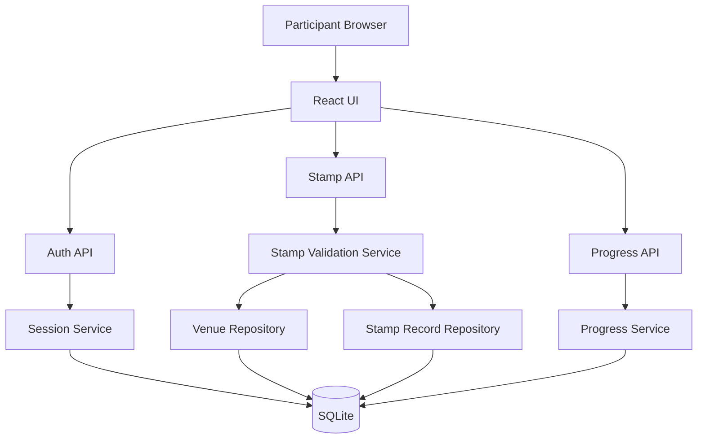
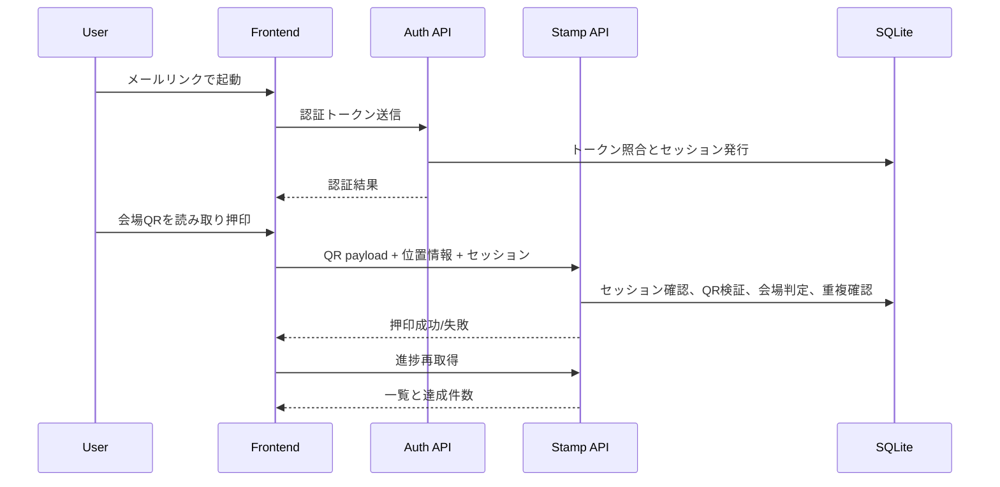

# Design Document

## Overview
本機能は、IMSグループ職員向け70周年イベントにおけるスタンプラリーMVPを、既存のReact + FastAPI + SQLite構成の拡張として実現する。  
参加者は案内メール内リンク/QRから素早く認証し、同一端末では再入力を最小化したまま会場QRで押印できる。

本設計は、押印の信頼性を高めるために「短TTL署名QR検証」と「会場緯度経度ベースの位置判定」を組み合わせる。  
運営機能はMVP外とし、運営側が事前に会場データと配布情報を準備済みである前提で、参加者体験に必要な責務へ限定する。

### Goals
- メール導線から数タップで参加開始できる
- 同一端末で再訪時の再認証負荷を下げる
- 会場QR押印と進捗表示を一貫した体験で提供する
- 不正押印を抑止し、結果の信頼性を保つ

### Non-Goals
- 企業SSO連携
- ネイティブアプリ化
- 景品抽選、ポイント連携、分析ダッシュボード
- 高度な不正検知（端末指紋厳密照合、行動分析）

## Boundary Commitments

### This Spec Owns
- 参加者向け初回認証と端末再訪認証のWebフロー
- 会場QR押印処理（検証、重複防止、結果表示）
- 会場緯度経度に基づく押印可否判定
- 参加者ごとのスタンプ進捗表示

### Out of Boundary
- メール配信基盤の構築/運用
- イベント会場データの入力UI
- 景品管理、抽選、満足度アンケート機能
- 社内認証基盤との統合

### Allowed Dependencies
- 既存 `frontend` Reactアプリ
- 既存 `backend` FastAPIアプリ
- SQLite（既存データストア）
- ブラウザの位置情報API

### Revalidation Triggers
- 認証トークン契約（有効期限、署名形式）の変更
- 会場データの必須属性変更（緯度経度や許可半径）
- 押印判定順序（QR検証→位置判定→重複判定）の変更
- セッション有効期限や失効ポリシーの変更

## Architecture

### Existing Architecture Analysis
- 現行は `stamps` 単一テーブルを参照するサンプル実装で、参加者概念を持たない。
- フロントは単一画面で一覧取得とトグル更新のみを行う。
- バックエンドは `main.py` 集約で、認証や押印の責務分離がない。

### Architecture Pattern & Boundary Map
**Architecture Integration**:
- Selected pattern: 既存モノリシックAPI拡張 + ドメイン責務分割
- Domain boundaries: 認証、押印判定、会場参照、進捗参照を分離
- Existing patterns preserved: FastAPIルーティング + SQLite直結 + React fetch
- New components rationale: 認証セッション、押印検証、進捗集約を明確化するため
- Steering compliance: steering未整備のため、既存構成一貫性を優先



### Technology Stack

| Layer | Choice / Version | Role in Feature | Notes |
|-------|------------------|-----------------|-------|
| Frontend / CLI | React 19 + TypeScript + Vite 8 | 認証遷移、押印UI、進捗表示 | 既存構成を維持 |
| Backend / Services | FastAPI 0.136 + Pydantic 2 | 認証/押印/進捗API提供 | ドメイン別モジュール化 |
| Data / Storage | SQLite | 参加者、会場、押印履歴、セッション管理 | MVPは単一DB |
| Messaging / Events | N/A | 非同期連携なし | MVP範囲外 |
| Infrastructure / Runtime | Docker Compose | ローカル検証実行 | 既存 `make up/down` 利用 |

## File Structure Plan

### Directory Structure
```text
frontend/src/
├── app/
│   ├── types.ts                 # API契約の型定義
│   ├── auth-client.ts           # 認証/セッションAPI呼び出し
│   └── stamp-client.ts          # 押印/進捗API呼び出し
├── features/
│   ├── auth/
│   │   └── AuthGate.tsx         # 初回認証と再訪判定画面
│   └── stamp/
│       ├── StampList.tsx        # 一覧と進捗表示
│       └── StampScanAction.tsx  # QR入力/位置情報連携押印
└── App.tsx                      # 画面遷移と全体状態管理

backend/app/
├── main.py                      # ルート登録と依存初期化
├── db.py                        # 接続・初期化・DDL実行
├── models.py                    # Pydanticリクエスト/レスポンス
├── auth_service.py              # 認証トークン検証、セッション管理
├── stamp_service.py             # 押印判定（QR/位置/重複）
├── progress_service.py          # 参加者別進捗集約
├── repositories/
│   ├── participant_repo.py      # 参加者/セッション参照
│   ├── venue_repo.py            # 会場参照
│   └── stamp_record_repo.py     # 押印履歴参照/更新
└── routes/
    ├── auth_routes.py           # /api/auth/* エンドポイント
    └── stamp_routes.py          # /api/stamps/* エンドポイント
```

### Modified Files
- `frontend/src/App.tsx` — 認証ゲート導入と画面責務分割
- `frontend/src/App.css` — 認証/押印状態表示のスタイル追加
- `backend/app/main.py` — 既存エンドポイント分割と新ルート組み込み
- `backend/app/db.py` — 新テーブルDDLと初期データ投入
- `README.md` — 新APIフローと運用前提の更新

## System Flows



Key Decisions:
- 押印は単一APIで完結し、失敗理由を参加者に返す。
- 進捗画面は押印後に再取得して整合性を優先する。

## Requirements Traceability

| Requirement | Summary | Components | Interfaces | Flows |
|-------------|---------|------------|------------|-------|
| 1 | 参加導線と初回認証 | AuthGate, Auth API, Session Service | `POST /api/auth/activate` | 起動〜認証 |
| 2 | 端末記憶による再訪 | AuthGate, Session Service | `GET /api/auth/session` | 起動時判定 |
| 3 | 会場QR押印 | StampScanAction, Stamp Validation Service | `POST /api/stamps/scan` | 押印フロー |
| 4 | 位置情報判定 | Stamp Validation Service, Venue Repository | `POST /api/stamps/scan` | 押印フロー |
| 5 | 不正/異常拒否 | Stamp Validation Service, Error Mapper | `POST /api/stamps/scan` | 押印フロー |
| 6 | 進捗可視化 | StampList, Progress Service | `GET /api/stamps/progress` | 押印後再取得 |

## Components and Interfaces

| Component | Domain/Layer | Intent | Req Coverage | Key Dependencies (P0/P1) | Contracts |
|-----------|--------------|--------|--------------|---------------------------|-----------|
| AuthGate | Frontend | 認証状態に応じた画面遷移 | 1, 2 | auth-client (P0) | Service, State |
| StampScanAction | Frontend | 押印実行と結果表示 | 3, 4, 5 | stamp-client (P0) | Service, State |
| StampList | Frontend | 進捗と一覧表示 | 6 | stamp-client (P0) | Service, State |
| Auth API | Backend Route | 初回認証/再訪判定 | 1, 2 | auth_service (P0) | API |
| Stamp API | Backend Route | 押印/進捗契約提供 | 3, 4, 5, 6 | stamp_service (P0) | API |
| Stamp Validation Service | Backend Domain | 押印可否判定統合 | 3, 4, 5 | repositories (P0) | Service |
| Progress Service | Backend Domain | 参加者別進捗集約 | 6 | stamp_record_repo (P0) | Service |

### Frontend

#### AuthGate

| Field | Detail |
|-------|--------|
| Intent | 起動時の認証遷移を統一制御 |
| Requirements | 1, 2 |

**Responsibilities & Constraints**
- 初回認証と再訪判定を分岐
- 未認証時は押印UIへ進ませない
- 認証失敗理由をユーザーに可視化

**Dependencies**
- Inbound: `App.tsx` — 初期表示制御 (P0)
- Outbound: `auth-client.ts` — API呼び出し (P0)

**Contracts**: Service [x] / API [ ] / Event [ ] / Batch [ ] / State [x]

##### Service Interface
```typescript
interface AuthClient {
  activate(token: string): Promise<ActivateResult>;
  fetchSession(): Promise<SessionResult>;
}
```

#### StampScanAction

| Field | Detail |
|-------|--------|
| Intent | 押印要求を安全に送信し結果表示 |
| Requirements | 3, 4, 5 |

**Dependencies**
- Inbound: `StampList.tsx` — ユーザー操作 (P0)
- Outbound: `stamp-client.ts` — 押印API呼び出し (P0)
- External: Browser Geolocation API — 現在地取得 (P0)

**Contracts**: Service [x] / API [ ] / Event [ ] / Batch [ ] / State [x]

##### Service Interface
```typescript
interface StampClient {
  scan(input: ScanRequest): Promise<ScanResult>;
  fetchProgress(): Promise<ProgressResult>;
}
```

### Backend

#### Auth API

| Field | Detail |
|-------|--------|
| Intent | 認証トークン検証とセッション発行 |
| Requirements | 1, 2 |

**Contracts**: Service [ ] / API [x] / Event [ ] / Batch [ ] / State [ ]

##### API Contract
| Method | Endpoint | Request | Response | Errors |
|--------|----------|---------|----------|--------|
| POST | /api/auth/activate | `{ token: string, device_label?: string }` | `{ session_token: string, participant_id: string }` | 400, 401, 410 |
| GET | /api/auth/session | Header `Authorization` | `{ participant_id: string, active: boolean }` | 401 |

#### Stamp API

| Field | Detail |
|-------|--------|
| Intent | 押印判定と進捗取得の公開契約 |
| Requirements | 3, 4, 5, 6 |

**Contracts**: Service [ ] / API [x] / Event [ ] / Batch [ ] / State [ ]

##### API Contract
| Method | Endpoint | Request | Response | Errors |
|--------|----------|---------|----------|--------|
| POST | /api/stamps/scan | `{ qr_payload: string, latitude: number, longitude: number }` | `{ status: "stamped" \| "already_stamped", stamp_id: string }` | 400, 401, 403, 409, 410 |
| GET | /api/stamps/progress | Header `Authorization` | `{ total: number, completed: number, items: StampItem[] }` | 401, 500 |

#### Stamp Validation Service

| Field | Detail |
|-------|--------|
| Intent | 押印の検証パイプラインを統合 |
| Requirements | 3, 4, 5 |

**Responsibilities & Constraints**
- 認証セッション検証
- QR署名/TTL検証
- 会場ジオフェンス判定
- 重複押印防止

**Dependencies**
- Inbound: `stamp_routes.py` — 押印要求 (P0)
- Outbound: `participant_repo.py` — セッション検証 (P0)
- Outbound: `venue_repo.py` — 会場参照 (P0)
- Outbound: `stamp_record_repo.py` — 重複判定と保存 (P0)

**Contracts**: Service [x] / API [ ] / Event [ ] / Batch [ ] / State [ ]

##### Service Interface
```python
class StampValidationService:
    def validate_and_stamp(
        self,
        session_token: str,
        qr_payload: str,
        latitude: float,
        longitude: float,
    ) -> "StampDecision":
        ...
```

## Data Models

### Domain Model
- Participant: イベント参加者の識別主体
- DeviceSession: 端末再訪判定に利用するセッション
- Venue: 会場マスタ（緯度経度、判定半径、有効期間）
- StampRecord: 参加者ごとの押印履歴

### Logical Data Model
- `participants` 1 : N `device_sessions`
- `participants` 1 : N `stamp_records`
- `venues` 1 : N `stamp_records`
- 一意制約: `(participant_id, venue_id)` で重複押印を防止

### Physical Data Model
- `participants(id, email_hash, created_at)`
- `device_sessions(id, participant_id, session_token_hash, expires_at, revoked_at)`
- `venues(id, code, name, lat, lon, radius_m, active_from, active_until)`
- `stamp_records(id, participant_id, venue_id, stamped_at, source)`
- インデックス:
  - `idx_sessions_token` on `device_sessions(session_token_hash)`
  - `uniq_participant_venue` on `stamp_records(participant_id, venue_id)`
  - `idx_stamp_records_participant` on `stamp_records(participant_id, stamped_at)`

## Error Handling

### Error Strategy
- 入力不正、認証失敗、位置不一致、QR無効、重複押印を明示的に分離
- 参加者へは再試行可能性を示すメッセージを返す

### Error Categories and Responses
- User Errors (4xx): 位置情報拒否、無効QR、期限切れトークン
- Business Logic Errors (409/422): 既取得会場、イベント期間外
- System Errors (5xx): DB競合、予期しない例外（再試行導線を提示）

### Monitoring
- 押印成功率、失敗理由別件数、位置情報拒否率を計測対象にする

## Testing Strategy

### Unit Tests
- QR署名/TTL検証ロジックが有効・無効ケースを正しく判定する
- ジオフェンス判定が許可範囲内/外を正しく判定する
- 重複押印判定が同一参加者・同一会場の再押印を拒否する

### Integration Tests
- 認証後に `scan` 実行で押印履歴と進捗が一貫更新される
- 位置情報不一致時に押印が拒否され履歴が作成されない
- 期限切れQR時に押印が拒否される

### E2E/UI Tests
- メール導線起動から認証完了までの遷移
- 再訪時に認証画面を経ず進捗画面へ遷移
- 押印成功後に達成件数が更新される

### Performance/Load
- 同時押印リクエスト時の成功率とレスポンス時間測定
- SQLite書き込み競合時のリトライ挙動確認

## Security Considerations
- セッション識別子は平文保存せずハッシュ照合を前提とする
- QR payloadは署名と期限を検証し、期限外利用を拒否する
- 位置情報は押印判定用途に限定し、不要な長期保持を避ける

## Performance & Scalability
- 体感上の押印結果表示は3秒以内を目標とする
- 進捗表示は押印直後の再取得で整合性優先、必要に応じて将来キャッシュを検討
- 25,000人規模イベントを想定し、ピーク時の同時押印試験を実施する
